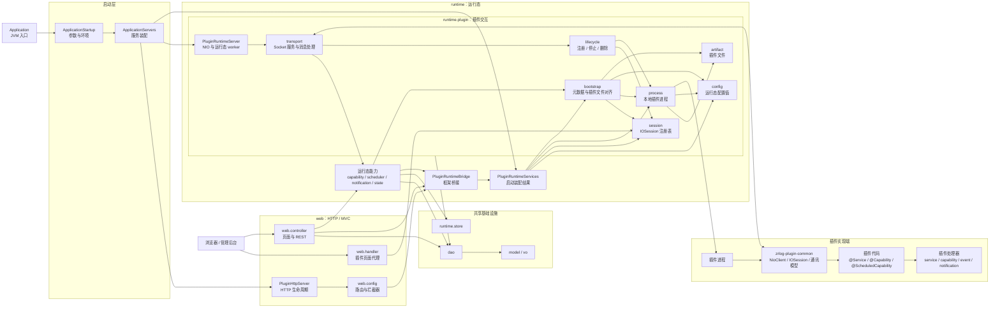
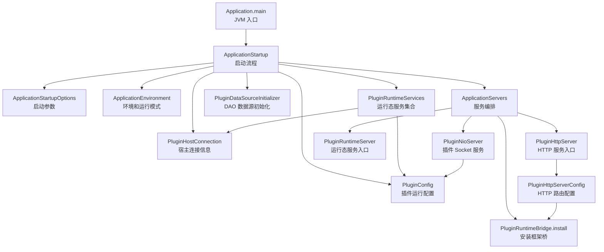
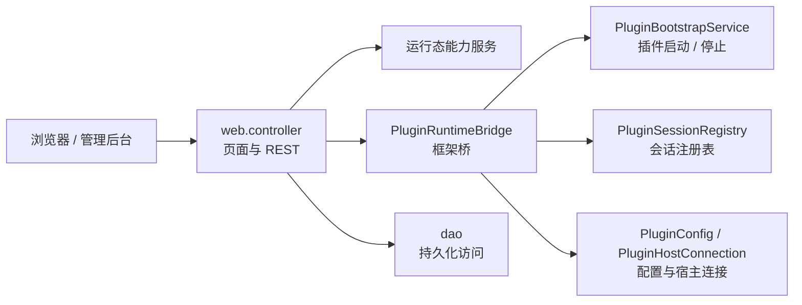
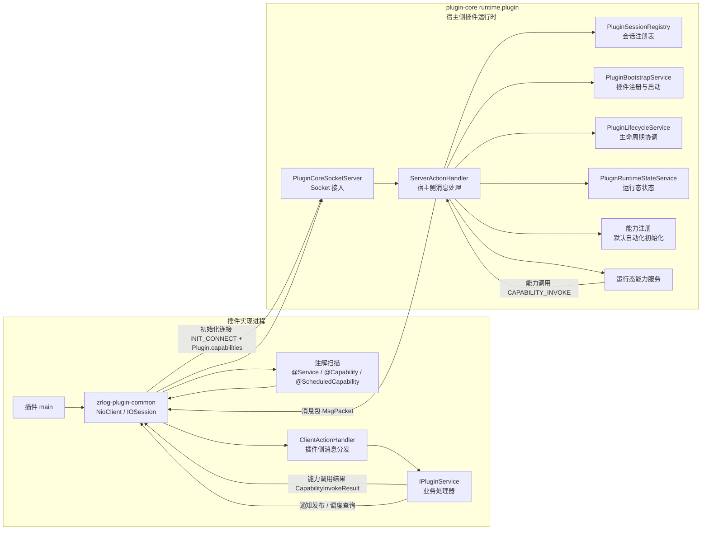

# 插件核心架构

本文记录当前 `zrlog-plugin-core` 的包边界和主要调用方向。整体按两个服务面整理：

1. `web` 负责 HTTP、UI 和标准 MVC。
2. `runtime` 负责插件交互、插件进程、Socket 通讯和运行态能力。

## 系统边界

边界图只表达包方向和主要交接点。启动装配、HTTP 控制、插件 Socket 通讯拆成独立图，避免把它们看成一条混在一起的运行态依赖链。

## 启动装配

`PluginRuntimeServices` 在启动阶段创建，随后被立即拆成更窄的依赖传入各个服务。运行态服务端代码只接收自己需要的依赖，例如 `PluginConfig` 和 `PluginBootstrapService`。

## HTTP 控制流

`PluginRuntimeBridge` 只服务于不能通过构造器接收依赖的框架创建对象。新的运行态代码应优先使用显式构造器依赖。

## 插件 Socket 流

生命周期状态只描述插件连接、会话注册和路由可用性。能力、调度或默认自动化失败应保留在各自的运行态结果或日志路径里。

## 插件实现端边界

插件实现端不属于 `plugin-core`。它运行在插件进程内，依赖 `zrlog-plugin-common` 提供 Socket 协议、DTO、注解和客户端消息分发。

核心规则：

1. `plugin-core` 不扫描插件 classpath。
2. `zrlog-plugin-common` 在插件侧扫描 `@Service`、`@Capability` 和 `@ScheduledCapability`。
3. 插件能力元数据在 `INIT_CONNECT` 阶段通过 `Plugin.capabilities` 发送给 core。
4. `plugin-core` 注册这些元数据，并通过 `CAPABILITY_INVOKE` 等 Socket 消息调用插件工作。
5. 插件业务代码实现 `IPluginService` 等处理器；它不直接修改 plugin-core 的调度状态。
6. 插件发起的运行态调用，例如 `NOTIFICATION_PUBLISH` 和 `SCHEDULER_QUERY`，通过 `ServerActionHandler` 进入 plugin-core。

## 依赖规则

1. `web` 可以依赖 `runtime`、`dao`、`model`、`vo` 和 `util`。
2. `runtime` 不能依赖 `web`。
3. 插件 Socket 流量从 `runtime.plugin.transport` 进入，不能从 `web` 进入。
4. 插件进程、会话、启动和生命周期代码放在 `runtime.plugin` 下。
5. 运行态能力包通过 `PluginBootstrapService`、`PluginSessions` 和 `PluginFiles` 等公开入口调用插件侧能力。
6. `runtime.plugin.artifact` 只处理文件，不依赖 bootstrap 或 lifecycle。
7. `runtime.plugin.bootstrap` 可以依赖 artifact、process 和 session，因为它负责协调启动。
8. `runtime.plugin.lifecycle` 负责 process 与 session 之间的注册、停止、删除等横向协调。
9. HTTP 服务配置属于 `web.config`。
10. 插件运行态配置值属于 `runtime.plugin.config`，由启动层装配进 `PluginRuntimeServices`。
11. 数据源初始化是明确的启动工作，保留在 `PluginDataSourceInitializer`；`PluginConfig` 是值对象，不负责初始化。
12. `Application` 保持为 JVM 入口。参数解析、环境准备和服务编排分别交给启动层类。
13. `ApplicationServers` 只启动两类服务：运行态插件服务和 web 侧 HTTP 服务。
14. 插件生命周期状态绑定到宿主连接和路由可用性。能力、调度、默认自动化失败应保留在各自的运行态结果或日志路径。
15. `ApplicationServers` 负责服务装配：它把 `PluginRuntimeServices` 拆成 `PluginRuntimeServer` 所需的窄依赖，同时把同一组服务传给 `PluginHttpServerConfig` 用于 web 桥接。
16. `PluginRuntimeServer` 不能持有完整的运行态服务集合；它只持有启动和停止运行态服务所需的依赖。
17. `PluginRuntimeServices` 是启动装配结果，不是通用 application context，也不是 web 控制运行态的 API。新代码应优先使用显式构造器参数或 `PluginRuntimeBridge` 的窄方法。
18. 插件实现代码在 `plugin-core` 之外；core 不能扫描插件 classpath。
19. 插件侧元数据由 `zrlog-plugin-common` 收集，并通过 `Plugin.capabilities` 等 Socket 通讯模型发送给 core。

## 主要包

`com.zrlog.plugincore.server.web.controller`
: 标准 MVC controller 层，负责管理后台页面和 HTTP API。

`com.zrlog.plugincore.server.web.config`
: HTTP 服务路由、静态资源映射、HTTP 拦截器，以及 web controller 使用的运行态桥接安装。

`com.zrlog.plugincore.server.web.PluginHttpServer`
: HTTP 服务生命周期包装，负责组合 `PluginHttpServerConfig` 和 `WebServerBuilder`。

`com.zrlog.plugincore.server.web.handler`
: 插件渲染页面的 web 适配层。它解析目标插件会话并代理 HTTP 数据包，但不拥有插件启动内部逻辑。

`com.zrlog.plugincore.server.web.util`
: web 专用工具，例如把内存中的运行态列表分页成 commonDAO `PageData`。

`com.zrlog.plugincore.server.runtime.PluginRuntimeServices`
: 启动装配结果，包含插件运行态服务和启动后不可变的值。它替代之前的 context 对象，但不能作为宽泛业务 API 使用。

`com.zrlog.plugincore.server.runtime.PluginRuntimeBridge`
: 窄框架桥，用于不能通过构造器注入依赖的代码。优先使用 `pluginBootstrap()` 等明确方法，不传递完整 services 对象。

`com.zrlog.plugincore.server.runtime.plugin.PluginRuntimeServer`
: 运行态服务生命周期。它启动插件 NIO transport，并在非 native-agent 模式下启动运行态 worker。它直接接收 NIO、bootstrap 和 scheduler 依赖，不持有完整运行态服务集合。

`com.zrlog.plugincore.server.runtime.plugin.config`
: 插件运行态值对象，包括插件路径、FaaS 运行根目录、master 端口、blog 运行模式、宿主连接，以及明确的数据源初始化。

`com.zrlog.plugincore.server.runtime.plugin.transport`
: 插件进程连接回 plugin-core 的 TCP/Socket 适配层。

`com.zrlog.plugincore.server.runtime.plugin.session`
: 内存会话注册表，以及兼容现有查询调用的门面。

`com.zrlog.plugincore.server.runtime.plugin.process`
: 本地插件进程启动器、进程输出、退出监听、进程 ID 和运行态实例 ID。

`com.zrlog.plugincore.server.runtime.plugin.bootstrap`
: 启动编排、元数据收集、已安装插件文件对齐，以及异步 bootstrap。

`com.zrlog.plugincore.server.runtime.plugin.lifecycle`
: 跨会话注册表、进程运行态、插件元数据和运行态引用的注册、注销、停止、删除协调。

`com.zrlog.plugincore.server.runtime.*`
: 运行态能力，包括 capability、scheduler、notification、event、服务提供者选择、调用日志、状态和 KV 存储访问。

插件实现端
: 插件实现依赖 `zrlog-plugin-common`，通过插件侧注解声明 service/capability，使用 `NioClient` / `IOSession` 连接回 core，并处理 `CAPABILITY_INVOKE` 等 Socket action。
