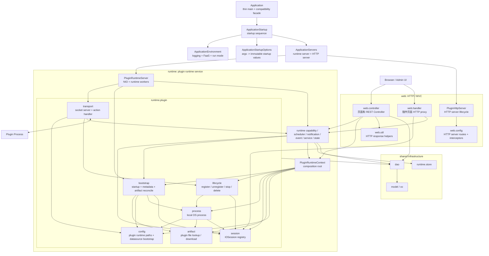

# Plugin Core Architecture

本文记录当前 `zrlog-plugin-core` 的包边界。目标是先按两个服务面向整理：

1. `web` 负责 HTTP/UI/MVC。
2. `runtime` 负责插件交互和运行态能力。

## Package Boundaries

## Dependency Rules

1. `web` may depend on `runtime`, `dao`, `model`, `vo`, and `util`.
2. `runtime` must not depend on `web`.
3. Plugin socket traffic enters through `runtime.plugin.transport`; it must not enter `web`.
4. Plugin process/session/bootstrap/lifecycle code stays under `runtime.plugin`.
5. Runtime feature packages call plugin code through public runtime-plugin entry points such as `PluginBootstrapService`, `PluginSessions`, and `PluginFiles`.
6. `runtime.plugin.artifact` is file-only; it must not depend on bootstrap or lifecycle.
7. `runtime.plugin.bootstrap` may depend on artifact, process, and session because it coordinates startup.
8. `runtime.plugin.lifecycle` owns cross-cutting stop/register/delete coordination between process and session.
9. HTTP server configuration belongs to `web.config`.
10. Plugin runtime configuration belongs to `runtime.plugin.config`.
11. `Application` stays as the JVM entry and compatibility facade. Argument parsing, environment setup, and server orchestration are separate startup classes.
12. `ApplicationServers` starts only the runtime-side plugin server and the web-side HTTP server.
13. Plugin lifecycle state is tied to host connection and routing viability. Capability, scheduler, and default automation failures should stay in their own runtime result or log path.

## Main Packages

`com.zrlog.plugincore.server.web.controller`
: Standard MVC controller layer for admin pages and HTTP APIs.

`com.zrlog.plugincore.server.web.config`
: HTTP server routes, static resource mapping, and HTTP interceptors.

`com.zrlog.plugincore.server.web.PluginHttpServer`
: HTTP server lifecycle wrapper around `PluginHttpServerConfig` and `WebServerBuilder`.

`com.zrlog.plugincore.server.web.handler`
: Web adapter for plugin-rendered pages. It resolves the target plugin session and proxies HTTP packets, but it does not own plugin startup internals.

`com.zrlog.plugincore.server.web.util`
: Web-only helpers such as in-memory runtime-list pagination into commonDAO `PageData`.

`com.zrlog.plugincore.server.runtime.plugin.PluginRuntimeServer`
: Runtime-side server lifecycle. It starts the plugin NIO transport and, outside native-agent mode, starts runtime workers.

`com.zrlog.plugincore.server.runtime.plugin.config`
: Plugin runtime configuration, including plugin paths, FaaS runtime roots, master port, blog runtime, and datasource bootstrap.

`com.zrlog.plugincore.server.runtime.plugin.transport`
: TCP/socket adapter used by plugin processes to connect back to plugin-core.

`com.zrlog.plugincore.server.runtime.plugin.session`
: In-memory session registry and compatibility facade for existing lookup calls.

`com.zrlog.plugincore.server.runtime.plugin.process`
: Local process launcher, process output, exit watch, process id and runtime instance ids.

`com.zrlog.plugincore.server.runtime.plugin.bootstrap`
: Startup orchestration, metadata collection, installed artifact reconciliation, and async bootstrap.

`com.zrlog.plugincore.server.runtime.plugin.lifecycle`
: Register/unregister/stop/delete coordination across session registry, process runtime, plugin metadata, and runtime references.

`com.zrlog.plugincore.server.runtime.*`
: Runtime features such as capability, scheduler, notification, event, service provider selection, invocation log, state, and KV store access.
